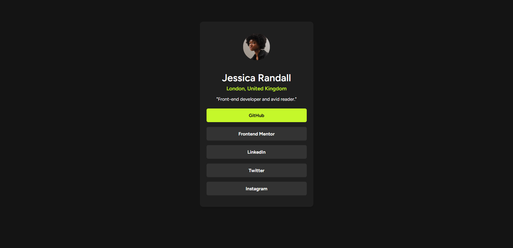

# Frontend Mentor - Social links profile solution

This is a solution to the [Social links profile challenge on Frontend Mentor](https://www.frontendmentor.io/challenges/social-links-profile-UG32l9m6dQ). Frontend Mentor challenges help you improve your coding skills by building realistic projects. 

## Table of contents

- [Overview](#overview)
  - [The challenge](#the-challenge)
  - [Screenshot](#screenshot)
  - [Links](#links)
- [My process](#my-process)
  - [Built with](#built-with)
  - [What I learned](#what-i-learned)
  - [Continued development](#continued-development)
- [Author](#author)

## Overview

### The challenge

Users should be able to:

- See hover and focus states for all interactive elements on the page

### Screenshot

Screenshot of my final result:



### Links

- Solution URL: [GitHub Repository](https://github.com/AriKILLER/Social-Links-Profile)
- Live Site URL: [Live Site URL](https://arikiller.github.io/Social-Links-Profile/)

## My process

Organised the HTML in no time knowing how to divide it using the div classes, seeing improvement in that regard. 

Decided to make a .css file and link it to the HTML in case I want to use this for future challenges like this one or other things.

Had a bit of a difficult time knowing how I could style the links so it isnt blue and underlined, but managed to figure it out, I was just trying to style the wrong thing.

Same with the reactive color of the letters, was just doing it wrong but got it right in the end.

Im really happy on how this turned out, probably the best one for now and in the shortest time by far.

### Built with

- Semantic HTML5 markup
- CSS custom properties

### What I learned

Learned how to style the links so its not blue and underlined, which its pretty useful since that by default its rather ugly.

I have noticed improvement in knowing how to organise the structure of the HTML and how to divide the page to make styling easier.

And finally made an .css file to make it cleaner and was able to link it to the HTML.

How the HTML turned out:

```html
 <div class="card">
    </img>
  <h2>Jessica Randall</h2>
  <strong>London, United Kingdom</strong>
  <p>"Front-end developer and avid reader."</p>

  <div class="social-links">
    <p><a href="https://github.com/" target="_blank">GitHub</a></p>
    <p><a href="https://www.frontendmentor.io/" target="_blank">Frontend Mentor</a></p>
    <p><a href="https://www.linkedin.com/" target="_blank">LinkedIn</a></p>
    <p><a href="https://twitter.com/" target="_blank">Twitter</a></p>
    <p><a href="https://www.instagram.com/" target="_blank">Instagram</a></p>
  </div>
</div>
```

Some css I like and that I didnt know how to do:

```css
.social-links a{
  color: hsl(0, 0%, 100%);
  text-decoration: none;
  font-family: 'Figtree', sans-serif;
  font-weight: 700;
  display: block;
  background-color: hsl(0, 0%, 20%);
  border-radius: 5px;
  padding: 12px;
  cursor: pointer;
  transition: background-color 0.3s ease;
}

.social-links a:hover{
  background-color: hsl(75, 94%, 57%);
  color: hsl(0, 0%, 8%);
}
```


### Continued development

Finally saw some improvement with the organisation of the HTML, now I feel like I need to get more comfortable on the styling and learn how to do things in automatic rather than just having to try to remember what did what, but overall, seeing improvement which is what matters.


## Author

- GitHub - [@AriKILLER](https://github.com/AriKILLER)
- Frontend Mentor - [@AriKILLER](https://www.frontendmentor.io/profile/AriKILLER)
- Discord - [@Ari_KILLER]

